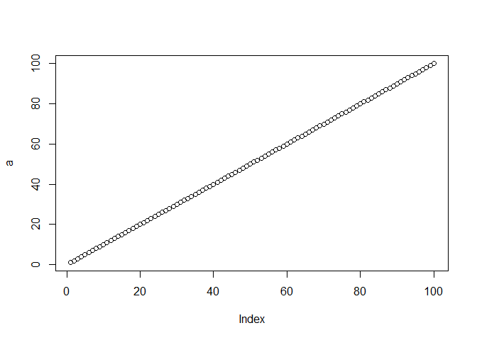
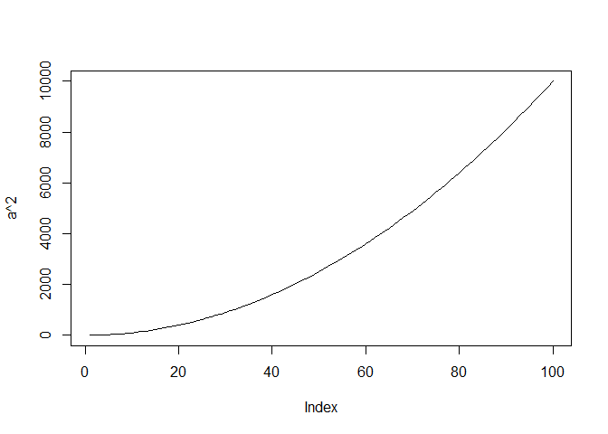
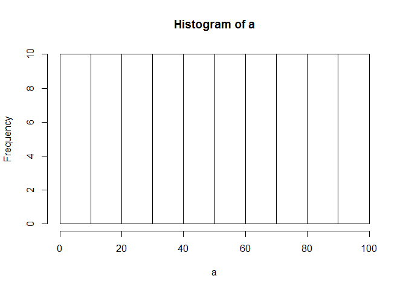

Software For Scientists (1st Day Afternoon)
================

-   [Greetings from Maine](#greetings-from-maine)
-   [Functions](#functions)
-   [Subsetting Data](#subsetting-data)
-   [Diversity Outbred Dataset](#diversity-outbred-dataset)
-   [Acknowledgements](#acknowledgements)

Greetings from Maine
--------------------

Before we start, please, put down your sticky notes, open a new R script (File -&gt; New File -&gt; R Script) and clear all objects from the memory (Environment tab -&gt; little broom icon).


And many greeting from [The Jackson Laboratory](https://www.jax.org/). Looking for a [postdoc position](https://www.jax.org/careers-and-training/career-opportunities/postdoc-positions)?

Functions
---------

### What is a function?

Functions gather a sequence of operations into a whole, preserving it for ongoing use.

Functions provide:

-   a name we can remember and invoke it by
-   relief from the need to remember the individual operations
-   a defined set of inputs and expected outputs
-   rich connections to the larger programming environment

In the morning you have learned to create a function with one argument. Now, we will continue with functions of two or more arguments.

### Functions of more than one argument

Let us start with a function adding two numbers:

``` r
# addition of two numbers
add <- function(a, b) {
  return(a+b)
}
```

#### Challenge 1:

Write a function of two arguments `a` and `b` that returns `a-b`, for example

``` r
substract(a=10, b=6)
```

    ## [1] 4

#### Challenge 1 extras:

What would you expect the following to do? Try out these commands and see what you get. Did this match your expectation?

``` r
substract(10, 6)
substract(b=6, a=10)
substract(b=6, 10)
b<-6; substract(a=10)
substract(a=10, b=a)
```

### Defining defaults

And a function can have even more arguments. For example, let us create a function that calculates `price` given `cost`, `profit` and `tax`.

``` r
price <- function(cost, profit, tax=20) {
  before_tax <- cost + profit
  after_tax <- before_tax * (1 + tax/100)
  return(after_tax)
}
```

Now we can call `price` function with just two arguments

``` r
price(cost=10, profit=5)
```

    ## [1] 18

#### Challenge 2:

This is a function for an addition of four numbers:

``` r
add4 <- function(a, b, c, d) {
  return(a+b+c+d)
}

add4(1,2,3,4)
```

    ## [1] 10

Modify this function, so it will work for one, two or three arguments

``` r
add4(1,2,3)
```

    ## [1] 6

``` r
add4(1,2)
```

    ## [1] 3

``` r
add4(8)
```

    ## [1] 8

#### Challenge 2 extras:

What would you expect the following to do? Try out these commands and see what you get. Did this match your expectation?

``` r
wrong_addition <- function(a) {
  return(a+b)
}

wrong_addition(1)
b <- 1
wrong_addition(1)
d <- wrong_addition(1)
b <- 3
d
rm(b) # removes variable b
wrong_addition(1)
d
```

### Some useful R functions

If you need a help for R function `something`, use `help(something)` or just `?something`. If you do not know the function name, try to google it (google: *R function for average*).

#### Challenge 3

What is R function for a standard deviation?


Some useful R functions include...

``` r
a <- 1:100
length(a)
```

    ## [1] 100

``` r
head(a)
```

    ## [1] 1 2 3 4 5 6

``` r
min(a)
```

    ## [1] 1

``` r
max(a)
```

    ## [1] 100

``` r
mean(a)
```

    ## [1] 50.5

``` r
sum(a)
```

    ## [1] 5050

``` r
# vectorization
head(a+1)
```

    ## [1] 2 3 4 5 6 7

``` r
sum(a^2)
```

    ## [1] 338350

``` r
sd(a^2)
```

    ## [1] 3024.356

``` r
# plotting functions
plot(a)
```



``` r
plot(a^2, type="l")
```



``` r
hist(a)
```



``` r
boxplot(a)
```


#### Challenge 4

The function for random generation from normalized Gaussion distribution is `rnorm`. Use `rnorm` to generate a vector of 10 numbers. Then, calculates the average and standard deviation of this vector and plot its histogram.

#### Challenge 4 extra

Instead of 10 numbers, try to generate 1000 or 100000 numbers. What happens? Why? (hint: LLN & CLT)

### Functions: Key Points

-   Define a function using `name <- function(...args...) {...body...}`.
-   Call a function using `name(...values...)`.
-   R looks for variables in the current stack frame before looking for them at the top level.
-   Use `help(thing)` or `?thing` to view help for something.
-   Put comments at the beginning of functions to provide help for that function. Annotate your code!
-   Specify default values for arguments when defining a function using `name = value` in the argument list.
-   Arguments can be passed by matching based on name, by position, or by omitting them (in which case the default value is used).

Subsetting Data
---------------

R has many powerful subset operators and mastering them will allow you to easily perform complex operations on any kind of dataset.

Let's start with the workhorse of R: atomic vectors.

``` r
x <- c(5.4, 6.2, 7.1, 4.8, 7.5)
names(x) <- c('a', 'b', 'c', 'd', 'e')
x
```

    ##   a   b   c   d   e 
    ## 5.4 6.2 7.1 4.8 7.5

So now that we've created a dummy vector to play with, how do we get at its contents?

### Accessing elements using their indices

To extract elements of a vector we can give their corresponding index, starting from one:

``` r
x[1]
```

    ##   a 
    ## 5.4

``` r
x[4]
```

    ##   d 
    ## 4.8

It may look different, but the square brackets operator is a function. For atomic vectors (and matrices), it means "get me the nth element".

We can ask for multiple elements at once:

``` r
x[c(1, 3)]
```

    ##   a   c 
    ## 5.4 7.1

Or slices of the vector:

``` r
x[1:4]
```

    ##   a   b   c   d 
    ## 5.4 6.2 7.1 4.8

the `:` operator creates a sequence of numbers from the left element to the right.

``` r
1:4
```

    ## [1] 1 2 3 4

``` r
c(1, 2, 3, 4)
```

    ## [1] 1 2 3 4

We can ask for the same element multiple times:

``` r
x[c(1,1,3)]
```

    ##   a   a   c 
    ## 5.4 5.4 7.1

If we ask for a number outside of the vector, R will return missing values:

``` r
x[6]
```

    ## <NA> 
    ##   NA

This is a vector of length one containing an `NA`, whose name is also `NA`.

### Skipping and removing elements

If we use a negative number as the index of a vector, R will return every element *except* for the one specified:

``` r
x[-2]
```

    ##   a   c   d   e 
    ## 5.4 7.1 4.8 7.5

We can skip multiple elements:

``` r
x[c(-1, -5)]  # or x[-c(1,5)]
```

    ##   b   c   d 
    ## 6.2 7.1 4.8

Tip: A common trip up for novices occurs when trying to skip slices of a vector. Most people first try to negate a sequence like so `x[-1:3]` gives a cryptic error.

To remove elements from a vector, we need to assign the results back into the variable:

``` r
x <- x[-4]
x
```

    ##   a   b   c   e 
    ## 5.4 6.2 7.1 7.5

#### Challenge 1

Given the following code:

``` r
x <- c(5.4, 6.2, 7.1, 4.8, 7.5)
names(x) <- c('a', 'b', 'c', 'd', 'e')
print(x)
```

    ##   a   b   c   d   e 
    ## 5.4 6.2 7.1 4.8 7.5

Come up with at least 3 different commands that will produce the following output:

    ##   b   c   d 
    ## 6.2 7.1 4.8

After you find 3 different commands, compare notes with your neighbour. Did you have different strategies?

### Subsetting by name

We can extract elements by using their name, instead of index:

``` r
x[c("a", "c")]
```

    ##   a   c 
    ## 5.4 7.1

This is usually a much more reliable way to subset objects: the position of various elements can often change when chaining together subsetting operations, but the names will always remain the same!

Unfortunately we can't skip or remove elements so easily.

To skip (or remove) a single named element:

``` r
x[-which(names(x) == "a")]
```

    ##   b   c   d   e 
    ## 6.2 7.1 4.8 7.5

The `which` function returns the indices of all `TRUE` elements of its argument. Remember that expressions evaluate before being passed to functions. Let's break this down so that its clearer what's happening.

First this happens:

``` r
names(x) == "a"
```

    ## [1]  TRUE FALSE FALSE FALSE FALSE

The condition operator is applied to every name of the vector `x`. Only the first name is "a" so that element is TRUE.

`which` then converts this to an index:

``` r
which(names(x) == "a")
```

    ## [1] 1

Only the first element is `TRUE`, so `which` returns 1. Now that we have indices the skipping works because we have a negative index!

Skipping multiple named indices is similar, but uses a different comparison operator:

``` r
x[-which(names(x) %in% c("a", "c"))]
```

    ##   b   d   e 
    ## 6.2 4.8 7.5

The `%in%` goes through each element of its left argument, in this case the names of `x`, and asks, "Does this element occur in the second argument?".

#### Challenge 2

Run the following code to define vector `x` as above:

``` r
x <- c(5.4, 6.2, 7.1, 4.8, 7.5)
names(x) <- c('a', 'b', 'c', 'd', 'e')
print(x)
```

    ##   a   b   c   d   e 
    ## 5.4 6.2 7.1 4.8 7.5

Given this vector `x`, what would you expect the following to do?

``` r
x[-which(names(x) == "g")]
```

Try out this command and see what you get. Did this match your expectation? Why did we get this result? (Tip: test out each part of the command on it's own - this is a useful debugging strategy)

Which of the following are true:

1.  if there are no `TRUE` values passed to `which`, an empty vector is returned
2.  if there are no `TRUE` values passed to `which`, an error message is shown
3.  `integer()` is an empty vector
4.  making an empty vector negative produces an "everything" vector
5.  `x[]` gives the same result as `x[integer()]`

Why do we need `%in%` and why can't we use `==` like before? That's an excellent question.

Let's take a look at the comparison component of this code:

``` r
names(x) == c('a', 'c')
```

    ## Warning in names(x) == c("a", "c"): longer object length is not a multiple
    ## of shorter object length

    ## [1]  TRUE FALSE FALSE FALSE FALSE

Obviously "c" is in the names of `x`, so why didn't this work? `==` works slightly differently than `%in%`. It will compare each element of its left argument to the corresponding element of its right argument.

Here's a mock illustration:

``` r
c("a", "b", "c", "e")  # names of x
   |    |    |    |    # The elements == is comparing
c("a", "c")
```

When one vector is shorter than the other, it gets *recycled*:

``` r
c("a", "b", "c", "e")  # names of x
   |    |    |    |    # The elements == is comparing
c("a", "c", "a", "c")
```

In this case R simply repeats `c("a", "c")` twice. If the longer vector length isn't a multiple of the shorter vector length, then R will also print out a warning message:

``` r
names(x) == c('a', 'c', 'e')
```

    ## Warning in names(x) == c("a", "c", "e"): longer object length is not a
    ## multiple of shorter object length

    ## [1]  TRUE FALSE FALSE FALSE FALSE

This difference between `==` and `%in%` is important to remember, because it can introduce hard to find and subtle bugs!

### Subsetting through other logical operations

We can also more simply subset through logical operations:

``` r
x[c(TRUE, TRUE, FALSE, FALSE)]
```

    ##   a   b   e 
    ## 5.4 6.2 7.5

Note that in this case, the logical vector is also recycled to the length of the vector we're subsetting!

``` r
x[c(TRUE, FALSE)]
```

    ##   a   c   e 
    ## 5.4 7.1 7.5

Since comparison operators evaluate to logical vectors, we can also use them to succinctly subset vectors:

``` r
x[x > 7]
```

    ##   c   e 
    ## 7.1 7.5

#### Challenge 3

Given the following code:

``` r
x <- c(5.4, 6.2, 7.1, 4.8, 7.5)
names(x) <- c('a', 'b', 'c', 'd', 'e')
print(x)
```

    ##   a   b   c   d   e 
    ## 5.4 6.2 7.1 4.8 7.5

Write a subsetting command to return the values in x that are greater than 4 and less than 7.

### Handling special values

At some point you will encounter functions in R which cannot handle missing, infinite, or undefined data.

There are a number of special functions you can use to filter out this data:

-   `is.na` will return all positions in a vector, matrix, or data.frame containing `NA`.
-   likewise, `is.nan`, and `is.infinite` will do the same for `NaN` and `Inf`.
-   `is.finite` will return all positions in a vector, matrix, or data.frame that do not contain `NA`, `NaN` or `Inf`.
-   `na.omit` will filter out all missing values from a vector

### Factor subsetting

Now that we've explored the different ways to subset vectors, how do we subset the other data structures?

Factor subsetting works the same way as vector subsetting.

``` r
f <- factor(c("a", "a", "b", "c", "c", "d"))
f[f == "a"]
```

    ## [1] a a
    ## Levels: a b c d

``` r
f[f %in% c("b", "c")]
```

    ## [1] b c c
    ## Levels: a b c d

``` r
f[1:3]
```

    ## [1] a a b
    ## Levels: a b c d

An important note is that skipping elements will not remove the level even if no more of that category exists in the factor:

``` r
f[-3]
```

    ## [1] a a c c d
    ## Levels: a b c d

### Matrix subsetting

Matrices are also subsetted using the `[` function. In this case it takes two arguments: the first applying to the rows, the second to its columns:

``` r
set.seed(1)
m <- matrix(rnorm(6*4), ncol=4, nrow=6)
m[3:4, c(3,1)]
```

    ##             [,1]       [,2]
    ## [1,]  1.12493092 -0.8356286
    ## [2,] -0.04493361  1.5952808

You can leave the first or second arguments blank to retrieve all the rows or columns respectively:

``` r
m[, c(3,4)]
```

    ##             [,1]        [,2]
    ## [1,] -0.62124058  0.82122120
    ## [2,] -2.21469989  0.59390132
    ## [3,]  1.12493092  0.91897737
    ## [4,] -0.04493361  0.78213630
    ## [5,] -0.01619026  0.07456498
    ## [6,]  0.94383621 -1.98935170

If we only access one row or column, R will automatically convert the result to a vector:

``` r
m[3,]
```

    ## [1] -0.8356286  0.5757814  1.1249309  0.9189774

If you want to keep the output as a matrix, you need to specify a *third* argument; `drop = FALSE`:

``` r
m[3, , drop=FALSE]
```

    ##            [,1]      [,2]     [,3]      [,4]
    ## [1,] -0.8356286 0.5757814 1.124931 0.9189774

Unlike vectors, if we try to access a row or column outside of the matrix, R will throw an error:

``` r
m[, c(3,6)]
```

    ## Error in m[, c(3, 6)]: subscript out of bounds

Because matrices are vectors, we can also subset using only one argument:

``` r
m[5]
```

    ## [1] 0.3295078

This usually isn't useful, and often confusing to read. However it is useful to note that matrices are laid out in *column-major format* by default. That is the elements of the vector are arranged column-wise:

``` r
matrix(1:6, nrow=2, ncol=3)
```

    ##      [,1] [,2] [,3]
    ## [1,]    1    3    5
    ## [2,]    2    4    6

If you wish to populate the matrix by row, use `byrow=TRUE`:

``` r
matrix(1:6, nrow=2, ncol=3, byrow=TRUE)
```

    ##      [,1] [,2] [,3]
    ## [1,]    1    2    3
    ## [2,]    4    5    6

Matrices can also be subsetted using their rownames and column names instead of their row and column indices.

#### Challenge 4

Given the following code:

``` r
m <- matrix(1:18, nrow=3, ncol=6)
print(m)
```

    ##      [,1] [,2] [,3] [,4] [,5] [,6]
    ## [1,]    1    4    7   10   13   16
    ## [2,]    2    5    8   11   14   17
    ## [3,]    3    6    9   12   15   18

1.  Which of the following commands will extract the values 11 and 14? A. `m[2,4,2,5]` B. `m[2:5]` C. `m[4:5,2]` D. `m[2,c(4,5)]`

### List subsetting

Now we'll introduce some new subsetting operators. There are three functions used to subset lists. `[`, as we've seen for atomic vectors and matrices, as well as `[[` and `$`.

Using `[` will always return a list. If you want to *subset* a list, but not *extract* an element, then you will likely use `[`.

``` r
xlist <- list(a = "Software Carpentry", b = 1:10, data = head(iris))
xlist[1]
```

    ## $a
    ## [1] "Software Carpentry"

This returns a *list with one element*.

We can subset elements of a list exactly the same was as atomic vectors using `[`. Comparison operations however won't work as they're not recursive, they will try to condition on the data structures in each element of the list, not the individual elements within those data structures.

``` r
xlist[1:2]
```

    ## $a
    ## [1] "Software Carpentry"
    ## 
    ## $b
    ##  [1]  1  2  3  4  5  6  7  8  9 10

To extract individual elements of a list, you need to use the double-square bracket function: `[[`.

``` r
xlist[[1]]
```

    ## [1] "Software Carpentry"

Notice that now the result is a vector, not a list.

You can't extract more than one element at once:

``` r
xlist[[1:2]]
```

    ## Error in xlist[[1:2]]: subscript out of bounds

Nor use it to skip elements:

``` r
xlist[[-1]]
```

    ## Error in xlist[[-1]]: attempt to select more than one element in get1index <real>

But you can use names to both subset and extract elements:

``` r
xlist[["a"]]
```

    ## [1] "Software Carpentry"

The `$` function is a shorthand way for extracting elements by name:

``` r
xlist$data
```

    ##   Sepal.Length Sepal.Width Petal.Length Petal.Width Species
    ## 1          5.1         3.5          1.4         0.2  setosa
    ## 2          4.9         3.0          1.4         0.2  setosa
    ## 3          4.7         3.2          1.3         0.2  setosa
    ## 4          4.6         3.1          1.5         0.2  setosa
    ## 5          5.0         3.6          1.4         0.2  setosa
    ## 6          5.4         3.9          1.7         0.4  setosa

#### Challenge 5

Given the following list:

``` r
xlist <- list(a = "Software Carpentry", b = 1:10, data = head(iris))
```

Using your knowledge of both list and vector subsetting, extract the number 2 from xlist.

Hint: the number 2 is contained within the "b" item in the list.

### Data frames

Remember the data frames are lists underneath the hood, so similar rules apply. However they are also two dimensional objects:

`[` with one argument will act the same was as for lists, where each list element corresponds to a column. The resulting object will be a data frame:

``` r
head(iris[5])
```

    ##   Species
    ## 1  setosa
    ## 2  setosa
    ## 3  setosa
    ## 4  setosa
    ## 5  setosa
    ## 6  setosa

Similarly, `[[` will act to extract *a single column*:

``` r
head(iris[["Sepal.Width"]])
```

    ## [1] 3.5 3.0 3.2 3.1 3.6 3.9

And `$` provides a convenient shorthand to extract columns by name:

``` r
head(iris$Sepal.Width)
```

    ## [1] 3.5 3.0 3.2 3.1 3.6 3.9

With two arguments, `[` behaves the same way as for matrices:

``` r
iris[1:3,]
```

    ##   Sepal.Length Sepal.Width Petal.Length Petal.Width Species
    ## 1          5.1         3.5          1.4         0.2  setosa
    ## 2          4.9         3.0          1.4         0.2  setosa
    ## 3          4.7         3.2          1.3         0.2  setosa

If we subset a single row, the result will be a data frame (because the elements are mixed types):

``` r
iris[3,]
```

    ##   Sepal.Length Sepal.Width Petal.Length Petal.Width Species
    ## 3          4.7         3.2          1.3         0.2  setosa

But for a single column the result will be a vector (this can be changed with the third argument, `drop = FALSE`).

We will wait with the challenges for the new dataset.

Diversity Outbred Dataset
-------------------------

The [Diversity Outbred](http://churchill.jax.org/research/cc/doresources.shtml) (DO) is a heterogeneous stock derived from eight inbred mouse strains. Prof. Karen Svenson collected various phenotypes of DO mice (both males and females) under either chow or high-fat diet.

The current dataset has over 800 hundred mice. We will use the subset of mice that has been previously published in Genetics (<https://dx.doi.org/10.1534/genetics.111.132597>)

``` r
# bit.ly/mousepheno is a shortcut for svenson_149.csv dataset
# see https://github.com/simecek/dc_2016_10 
dt <- read.csv("http://bit.ly/mousepheno")
```

We can now start asking questions:

-   How many mice and phenotypes do we have in the dataset?
-   How many males and females?
-   Extract the first row. Extract the body weight at 11 week (*BW.11*). Calculate the average body weight.

#### Challenge 1

Extract all mice with at least 40g at 11 weeks. How many of these mice were on high-fat diet?

#### Challenge 1 Extra

Compare high-fat and chow diets averages of body weight at 11 weeks (BW.11). Is it different for males and females?

Acknowledgements
----------------
