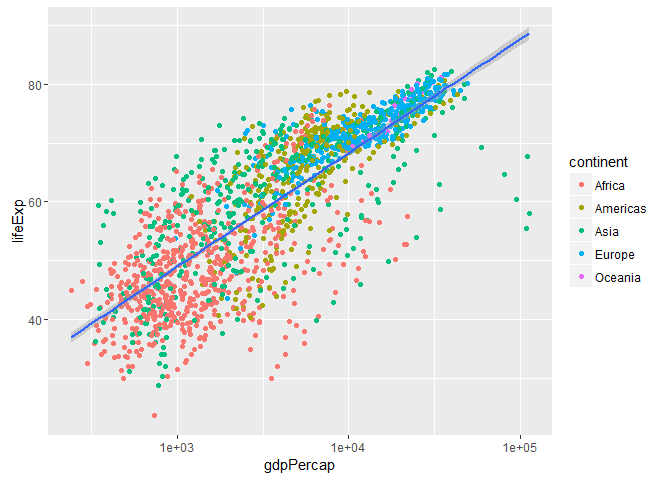

Software For Scientists (1st Day Afternoon)
================

-   [Greetings from Maine](#greetings-from-maine)
-   [Functions](#functions)
-   [Subsetting Data](#subsetting-data)
-   [Diversity Outbred Dataset](#diversity-outbred-dataset)
-   [Conditions and Loops](#conditions-and-loops)
-   [Plotting in R](#plotting-in-r)
-   [Acknowledgements](#acknowledgements)

Greetings from Maine
--------------------

Before we start, please, put down your sticky notes, open a new R script (File -> New File -> R Script) and clear all objects from the memory (Environment tab -> little broom icon).


And many greeting from [The Jackson Laboratory](https://www.jax.org/). Looking for a [postdoc position](https://www.jax.org/careers-and-training/career-opportunities/postdoc-positions)?

Functions
---------

### What is a function?

Functions gather a sequence of operations into a whole, preserving it for ongoing use.

Functions provide:

-   a name we can remember and invoke it by
-   relief from the need to remember the individual operations
-   a defined set of inputs and expected outputs
-   rich connections to the larger programming environment

In the morning you have learned to create a function with one argument. Now, we will continue with functions of two or more arguments.

### Functions of more than one argument

Let us start with a function adding two numbers:

``` r
# addition of two numbers
add <- function(a, b) {
  return(a+b)
}
```

#### Challenge 1:

Write a function of two arguments `a` and `b` that returns `a-b`, for example

``` r
substract(a=10, b=6)
```

    ## [1] 4

``` r
# YOUR CODE HERE.
```

#### Challenge 1 extras:

What would you expect the following to do? Try out these commands and see what you get. Did this match your expectation?

``` r
substract(10, 6)
substract(b=6, a=10)
substract(b=6, 10)
b<-6; substract(a=10)
substract(a=10, b=a)
```

### Defining defaults

And a function can have even more arguments. For example, let us create a function that calculates `price` given `cost`, `profit` and `tax`.

``` r
price <- function(cost, profit, tax=20) {
  before_tax <- cost + profit
  after_tax <- before_tax * (1 + tax/100)
  return(after_tax)
}
```

Now we can call `price` function with just two arguments

``` r
price(cost=10, profit=5)
```

    ## [1] 18

#### Challenge 2:

This is a function for an addition of four numbers:

``` r
add4 <- function(a, b, c, d) {
  return(a+b+c+d)
}

add4(1,2,3,4)
```

    ## [1] 10

Modify this function, so it will work for one, two or three arguments

``` r
add4(1,2,3)
```

    ## [1] 6

``` r
add4(1,2)
```

    ## [1] 3

``` r
add4(8)
```

    ## [1] 8

``` r
# YOUR CODE HERE.
```

#### Challenge 2 extras:

What would you expect the following to do? Try out these commands and see what you get. Did this match your expectation?

``` r
wrong_addition <- function(a) {
  return(a+b)
}

wrong_addition(1)
b <- 1
wrong_addition(1)
d <- wrong_addition(1)
b <- 3
d
rm(b) # removes variable b
wrong_addition(1)
d
```

### Some useful R functions

If you need a help for R function `something`, use `help(something)` or just `?something`. If you do not know the function name, try to google it (google: *R function for average*).

#### Challenge 3

What is R function for a standard deviation?


Some useful R functions include...

``` r
a <- 1:100
length(a)
```

    ## [1] 100

``` r
head(a)
```

    ## [1] 1 2 3 4 5 6

``` r
min(a)
```

    ## [1] 1

``` r
max(a)
```

    ## [1] 100

``` r
mean(a)
```

    ## [1] 50.5

``` r
sum(a)
```

    ## [1] 5050

``` r
# vectorization
head(a+1)
```

    ## [1] 2 3 4 5 6 7

``` r
sum(a^2)
```

    ## [1] 338350

``` r
sd(a^2)
```

    ## [1] 3024.356

``` r
# plotting functions
plot(a)
```


``` r
plot(a^2, type="l")
```


``` r
hist(a)
```


``` r
boxplot(a)
```


#### Challenge 4

The function for random generation from normalized Gaussion distribution is `rnorm`. Use `rnorm` to generate a vector of 10 numbers. Then, calculates the average and standard deviation of this vector and plot its histogram.

``` r
# YOUR CODE HERE.
```

#### Challenge 4 extra

Instead of 10 numbers, try to generate 1000 or 100000 numbers. What happens? Why? (hint: LLN & CLT)

### Functions: Key Points

-   Define a function using `name <- function(...args...) {...body...}`.
-   Call a function using `name(...values...)`.
-   R looks for variables in the current stack frame before looking for them at the top level.
-   Use `help(thing)` or `?thing` to view help for something.
-   Put comments at the beginning of functions to provide help for that function. Annotate your code!
-   Specify default values for arguments when defining a function using `name = value` in the argument list.
-   Arguments can be passed by matching based on name, by position, or by omitting them (in which case the default value is used).

Subsetting Data
---------------

R has many powerful subset operators and mastering them will allow you to easily perform complex operations on any kind of dataset.

Let's start with the workhorse of R: atomic vectors.

``` r
x <- c(5.4, 6.2, 7.1, 4.8, 7.5)
names(x) <- c('a', 'b', 'c', 'd', 'e')
x
```

    ##   a   b   c   d   e 
    ## 5.4 6.2 7.1 4.8 7.5

So now that we've created a dummy vector to play with, how do we get at its contents?

### Accessing elements using their indices

To extract elements of a vector we can give their corresponding index, starting from one:

``` r
x[1]
```

    ##   a 
    ## 5.4

``` r
x[4]
```

    ##   d 
    ## 4.8

It may look different, but the square brackets operator is a function. For atomic vectors (and matrices), it means "get me the nth element".

We can ask for multiple elements at once:

``` r
x[c(1, 3)]
```

    ##   a   c 
    ## 5.4 7.1

Or slices of the vector:

``` r
x[1:4]
```

    ##   a   b   c   d 
    ## 5.4 6.2 7.1 4.8

the `:` operator creates a sequence of numbers from the left element to the right.

``` r
1:4
```

    ## [1] 1 2 3 4

``` r
c(1, 2, 3, 4)
```

    ## [1] 1 2 3 4

We can ask for the same element multiple times:

``` r
x[c(1,1,3)]
```

    ##   a   a   c 
    ## 5.4 5.4 7.1

If we ask for a number outside of the vector, R will return missing values:

``` r
x[6]
```

    ## <NA> 
    ##   NA

This is a vector of length one containing an `NA`, whose name is also `NA`.

### Skipping and removing elements

If we use a negative number as the index of a vector, R will return every element *except* for the one specified:

``` r
x[-2]
```

    ##   a   c   d   e 
    ## 5.4 7.1 4.8 7.5

We can skip multiple elements:

``` r
x[c(-1, -5)]  # or x[-c(1,5)]
```

    ##   b   c   d 
    ## 6.2 7.1 4.8

Tip: A common trip up for novices occurs when trying to skip slices of a vector. Most people first try to negate a sequence like so `x[-1:3]` gives a cryptic error.

To remove elements from a vector, we need to assign the results back into the variable:

``` r
x <- x[-4]
x
```

    ##   a   b   c   e 
    ## 5.4 6.2 7.1 7.5

#### Challenge 5

Given the following code:

``` r
x <- c(5.4, 6.2, 7.1, 4.8, 7.5)
names(x) <- c('a', 'b', 'c', 'd', 'e')
print(x)
```

    ##   a   b   c   d   e 
    ## 5.4 6.2 7.1 4.8 7.5

Come up with at least 3 different commands that will produce the following output:

    ##   b   c   d 
    ## 6.2 7.1 4.8

After you find 3 different commands, compare notes with your neighbour. Did you have different strategies?

``` r
# YOUR CODE HERE.
```

### Subsetting by name

We can extract elements by using their name, instead of index:

``` r
x[c("a", "c")]
```

    ##   a   c 
    ## 5.4 7.1

This is usually a much more reliable way to subset objects: the position of various elements can often change when chaining together subsetting operations, but the names will always remain the same!

Unfortunately we can't skip or remove elements so easily.

To skip (or remove) a single named element:

``` r
x[-which(names(x) == "a")]
```

    ##   b   c   d   e 
    ## 6.2 7.1 4.8 7.5

The `which` function returns the indices of all `TRUE` elements of its argument. Remember that expressions evaluate before being passed to functions. Let's break this down so that its clearer what's happening.

First this happens:

``` r
names(x) == "a"
```

    ## [1]  TRUE FALSE FALSE FALSE FALSE

The condition operator is applied to every name of the vector `x`. Only the first name is "a" so that element is TRUE.

`which` then converts this to an index:

``` r
which(names(x) == "a")
```

    ## [1] 1

Only the first element is `TRUE`, so `which` returns 1. Now that we have indices the skipping works because we have a negative index!

Skipping multiple named indices is similar, but uses a different comparison operator:

``` r
x[-which(names(x) %in% c("a", "c"))]
```

    ##   b   d   e 
    ## 6.2 4.8 7.5

The `%in%` goes through each element of its left argument, in this case the names of `x`, and asks, "Does this element occur in the second argument?".

#### Challenge 6

Run the following code to define vector `x` as above:

``` r
x <- c(5.4, 6.2, 7.1, 4.8, 7.5)
names(x) <- c('a', 'b', 'c', 'd', 'e')
print(x)
```

    ##   a   b   c   d   e 
    ## 5.4 6.2 7.1 4.8 7.5

Given this vector `x`, what would you expect the following to do?

``` r
x[-which(names(x) == "g")]
```

Try out this command and see what you get. Did this match your expectation? Why did we get this result? (Tip: test out each part of the command on it's own - this is a useful debugging strategy)

Which of the following are true:

1.  if there are no `TRUE` values passed to `which`, an empty vector is returned
2.  if there are no `TRUE` values passed to `which`, an error message is shown
3.  `integer()` is an empty vector
4.  making an empty vector negative produces an "everything" vector
5.  `x[]` gives the same result as `x[integer()]`

``` r
# YOUR CODE HERE.
```

Why do we need `%in%` and why can't we use `==` like before? That's an excellent question.

Let's take a look at the comparison component of this code:

``` r
names(x) == c('a', 'c')
```

    ## Warning in names(x) == c("a", "c"): longer object length is not a multiple
    ## of shorter object length

    ## [1]  TRUE FALSE FALSE FALSE FALSE

Obviously "c" is in the names of `x`, so why didn't this work? `==` works slightly differently than `%in%`. It will compare each element of its left argument to the corresponding element of its right argument.

Here's a mock illustration:

``` r
c("a", "b", "c", "e")  # names of x
   |    |    |    |    # The elements == is comparing
c("a", "c")
```

When one vector is shorter than the other, it gets *recycled*:

``` r
c("a", "b", "c", "e")  # names of x
   |    |    |    |    # The elements == is comparing
c("a", "c", "a", "c")
```

In this case R simply repeats `c("a", "c")` twice. If the longer vector length isn't a multiple of the shorter vector length, then R will also print out a warning message:

``` r
names(x) == c('a', 'c', 'e')
```

    ## Warning in names(x) == c("a", "c", "e"): longer object length is not a
    ## multiple of shorter object length

    ## [1]  TRUE FALSE FALSE FALSE FALSE

This difference between `==` and `%in%` is important to remember, because it can introduce hard to find and subtle bugs!

### Subsetting through other logical operations

We can also more simply subset through logical operations:

``` r
x[c(TRUE, TRUE, FALSE, FALSE)]
```

    ##   a   b   e 
    ## 5.4 6.2 7.5

Note that in this case, the logical vector is also recycled to the length of the vector we're subsetting!

``` r
x[c(TRUE, FALSE)]
```

    ##   a   c   e 
    ## 5.4 7.1 7.5

Since comparison operators evaluate to logical vectors, we can also use them to succinctly subset vectors:

``` r
x[x > 7]
```

    ##   c   e 
    ## 7.1 7.5

#### Challenge 7

Given the following code:

``` r
x <- c(5.4, 6.2, 7.1, 4.8, 7.5)
names(x) <- c('a', 'b', 'c', 'd', 'e')
print(x)
```

    ##   a   b   c   d   e 
    ## 5.4 6.2 7.1 4.8 7.5

Write a subsetting command to return the values in x that are greater than 4 and less than 7.

``` r
# YOUR CODE HERE.
```

### Handling special values

At some point you will encounter functions in R which cannot handle missing, infinite, or undefined data.

There are a number of special functions you can use to filter out this data:

-   `is.na` will return all positions in a vector, matrix, or data.frame containing `NA`.
-   likewise, `is.nan`, and `is.infinite` will do the same for `NaN` and `Inf`.
-   `is.finite` will return all positions in a vector, matrix, or data.frame that do not contain `NA`, `NaN` or `Inf`.
-   `na.omit` will filter out all missing values from a vector

### Factor subsetting

Now that we've explored the different ways to subset vectors, how do we subset the other data structures?

Factor subsetting works the same way as vector subsetting.

``` r
f <- factor(c("a", "a", "b", "c", "c", "d"))
f[f == "a"]
```

    ## [1] a a
    ## Levels: a b c d

``` r
f[f %in% c("b", "c")]
```

    ## [1] b c c
    ## Levels: a b c d

``` r
f[1:3]
```

    ## [1] a a b
    ## Levels: a b c d

An important note is that skipping elements will not remove the level even if no more of that category exists in the factor:

``` r
f[-3]
```

    ## [1] a a c c d
    ## Levels: a b c d

### Matrix subsetting

Matrices are also subsetted using the `[` function. In this case it takes two arguments: the first applying to the rows, the second to its columns:

``` r
set.seed(1)
m <- matrix(rnorm(6*4), ncol=4, nrow=6)
m[3:4, c(3,1)]
```

    ##             [,1]       [,2]
    ## [1,]  1.12493092 -0.8356286
    ## [2,] -0.04493361  1.5952808

You can leave the first or second arguments blank to retrieve all the rows or columns respectively:

``` r
m[, c(3,4)]
```

    ##             [,1]        [,2]
    ## [1,] -0.62124058  0.82122120
    ## [2,] -2.21469989  0.59390132
    ## [3,]  1.12493092  0.91897737
    ## [4,] -0.04493361  0.78213630
    ## [5,] -0.01619026  0.07456498
    ## [6,]  0.94383621 -1.98935170

If we only access one row or column, R will automatically convert the result to a vector:

``` r
m[3,]
```

    ## [1] -0.8356286  0.5757814  1.1249309  0.9189774

If you want to keep the output as a matrix, you need to specify a *third* argument; `drop = FALSE`:

``` r
m[3, , drop=FALSE]
```

    ##            [,1]      [,2]     [,3]      [,4]
    ## [1,] -0.8356286 0.5757814 1.124931 0.9189774

Unlike vectors, if we try to access a row or column outside of the matrix, R will throw an error:

``` r
m[, c(3,6)]
```

    ## Error in m[, c(3, 6)]: subscript out of bounds

Because matrices are vectors, we can also subset using only one argument:

``` r
m[5]
```

    ## [1] 0.3295078

This usually isn't useful, and often confusing to read. However it is useful to note that matrices are laid out in *column-major format* by default. That is the elements of the vector are arranged column-wise:

``` r
matrix(1:6, nrow=2, ncol=3)
```

    ##      [,1] [,2] [,3]
    ## [1,]    1    3    5
    ## [2,]    2    4    6

If you wish to populate the matrix by row, use `byrow=TRUE`:

``` r
matrix(1:6, nrow=2, ncol=3, byrow=TRUE)
```

    ##      [,1] [,2] [,3]
    ## [1,]    1    2    3
    ## [2,]    4    5    6

Matrices can also be subsetted using their rownames and column names instead of their row and column indices.

#### Challenge 8

Given the following code:

``` r
m <- matrix(1:18, nrow=3, ncol=6)
print(m)
```

    ##      [,1] [,2] [,3] [,4] [,5] [,6]
    ## [1,]    1    4    7   10   13   16
    ## [2,]    2    5    8   11   14   17
    ## [3,]    3    6    9   12   15   18

1.  Which of the following commands will extract the values 11 and 14? A. `m[2,4,2,5]` B. `m[2:5]` C. `m[4:5,2]` D. `m[2,c(4,5)]`

``` r
# YOUR CODE HERE.
```

### List subsetting

Now we'll introduce some new subsetting operators. There are three functions used to subset lists. `[`, as we've seen for atomic vectors and matrices, as well as `[[` and `$`.

Using `[` will always return a list. If you want to *subset* a list, but not *extract* an element, then you will likely use `[`.

``` r
xlist <- list(a = "Software Carpentry", b = 1:10, data = head(iris))
xlist[1]
```

    ## $a
    ## [1] "Software Carpentry"

This returns a *list with one element*.

We can subset elements of a list exactly the same was as atomic vectors using `[`. Comparison operations however won't work as they're not recursive, they will try to condition on the data structures in each element of the list, not the individual elements within those data structures.

``` r
xlist[1:2]
```

    ## $a
    ## [1] "Software Carpentry"
    ## 
    ## $b
    ##  [1]  1  2  3  4  5  6  7  8  9 10

To extract individual elements of a list, you need to use the double-square bracket function: `[[`.

``` r
xlist[[1]]
```

    ## [1] "Software Carpentry"

Notice that now the result is a vector, not a list.

You can't extract more than one element at once:

``` r
xlist[[1:2]]
```

    ## Error in xlist[[1:2]]: subscript out of bounds

Nor use it to skip elements:

``` r
xlist[[-1]]
```

    ## Error in xlist[[-1]]: attempt to select more than one element in get1index <real>

But you can use names to both subset and extract elements:

``` r
xlist[["a"]]
```

    ## [1] "Software Carpentry"

The `$` function is a shorthand way for extracting elements by name:

``` r
xlist$data
```

    ##   Sepal.Length Sepal.Width Petal.Length Petal.Width Species
    ## 1          5.1         3.5          1.4         0.2  setosa
    ## 2          4.9         3.0          1.4         0.2  setosa
    ## 3          4.7         3.2          1.3         0.2  setosa
    ## 4          4.6         3.1          1.5         0.2  setosa
    ## 5          5.0         3.6          1.4         0.2  setosa
    ## 6          5.4         3.9          1.7         0.4  setosa

#### Challenge 9

Given the following list:

``` r
xlist <- list(a = "Software Carpentry", b = 1:10, data = head(iris))
```

Using your knowledge of both list and vector subsetting, extract the number 2 from xlist.

Hint: the number 2 is contained within the "b" item in the list.

``` r
# YOUR CODE HERE.
```

### Data frames

Remember the data frames are lists underneath the hood, so similar rules apply. However they are also two dimensional objects:

`[` with one argument will act the same was as for lists, where each list element corresponds to a column. The resulting object will be a data frame:

``` r
head(iris[5])
```

    ##   Species
    ## 1  setosa
    ## 2  setosa
    ## 3  setosa
    ## 4  setosa
    ## 5  setosa
    ## 6  setosa

Similarly, `[[` will act to extract *a single column*:

``` r
head(iris[["Sepal.Width"]])
```

    ## [1] 3.5 3.0 3.2 3.1 3.6 3.9

And `$` provides a convenient shorthand to extract columns by name:

``` r
head(iris$Sepal.Width)
```

    ## [1] 3.5 3.0 3.2 3.1 3.6 3.9

With two arguments, `[` behaves the same way as for matrices:

``` r
iris[1:3,]
```

    ##   Sepal.Length Sepal.Width Petal.Length Petal.Width Species
    ## 1          5.1         3.5          1.4         0.2  setosa
    ## 2          4.9         3.0          1.4         0.2  setosa
    ## 3          4.7         3.2          1.3         0.2  setosa

If we subset a single row, the result will be a data frame (because the elements are mixed types):

``` r
iris[3,]
```

    ##   Sepal.Length Sepal.Width Petal.Length Petal.Width Species
    ## 3          4.7         3.2          1.3         0.2  setosa

But for a single column the result will be a vector (this can be changed with the third argument, `drop = FALSE`).

We will wait with the challenges for the new dataset.

### Subsetting: Key Points

-   Indexing in R starts at 1, not 0.
-   Access individual values by location using `[]`.
-   Access slices of data using `[low:high]`.
-   Access arbitrary sets of data using `[c(...)]`.
-   Use which to select subsets of data based on value.

Diversity Outbred Dataset
-------------------------

The [Diversity Outbred](http://churchill.jax.org/research/cc/doresources.shtml) (DO) is a heterogeneous stock derived from eight inbred mouse strains. Prof. Karen Svenson collected various phenotypes of DO mice (both males and females) under either chow or high-fat diet.

The current dataset has over 800 hundred mice. We will use the subset of mice that has been previously published in Genetics (<https://dx.doi.org/10.1534/genetics.111.132597>)

``` r
# bit.ly/mousepheno is a shortcut for svenson_149.csv dataset
# see https://github.com/simecek/dc_2016_10 
dt <- read.csv("http://bit.ly/mousepheno")
```

We can now start asking questions:

-   How many mice and phenotypes do we have in the dataset?
-   How many males and females?
-   Extract the first row. Extract the body weight at 11 week (*BW.11*). Calculate the average body weight.

#### Challenge 10

Extract all mice with at least 40g at 11 week. How many of these mice were on high-fat diet?

#### Challenge 10 Extra

Compare high-fat and chow diets averages of body weight at 11 week (BW.11). Is it different for males and females?

``` r
# YOUR CODE HERE.
```

Conditions and Loops
--------------------

Often when we're coding we want to control the flow of our actions. This can be done by setting actions to occur only if a condition or a set of conditions are met. Alternatively, we can also set an action to occur a particular number of times.

### Repeating operations

If you want to iterate over a set of values, when the order of iteration is important, and perform the same operation on each, a `for()` loop will do the job. We saw `for()` loops in the shell lessons earlier. This is the most flexible of looping operations, but therefore also the hardest to use correctly. Avoid using `for()` loops unless the order of iteration is important: i.e. the calculation at each iteration depends on the results of previous iterations.

The basic structure of a `for()` loop is:

``` r
for(iterator in set of values){
  do a thing
}
```

For example:

``` r
for(i in 1:10){
  print(i)
}
```

    ## [1] 1
    ## [1] 2
    ## [1] 3
    ## [1] 4
    ## [1] 5
    ## [1] 6
    ## [1] 7
    ## [1] 8
    ## [1] 9
    ## [1] 10

The `1:10` bit creates a vector on the fly; you can iterate over any other vector as well.

We can use a `for()` loop nested within another `for()` loop to iterate over two things at once.

``` r
for(i in 1:5){
  for(j in c('a', 'b', 'c', 'd', 'e')){
    print(paste(i,j))
  }
}
```

    ## [1] "1 a"
    ## [1] "1 b"
    ## [1] "1 c"
    ## [1] "1 d"
    ## [1] "1 e"
    ## [1] "2 a"
    ## [1] "2 b"
    ## [1] "2 c"
    ## [1] "2 d"
    ## [1] "2 e"
    ## [1] "3 a"
    ## [1] "3 b"
    ## [1] "3 c"
    ## [1] "3 d"
    ## [1] "3 e"
    ## [1] "4 a"
    ## [1] "4 b"
    ## [1] "4 c"
    ## [1] "4 d"
    ## [1] "4 e"
    ## [1] "5 a"
    ## [1] "5 b"
    ## [1] "5 c"
    ## [1] "5 d"
    ## [1] "5 e"

Rather than printing the results, we could write the loop output to a new object.

``` r
output_vector <- c()
for(i in 1:5){
  for(j in c('a', 'b', 'c', 'd', 'e')){
    temp_output <- paste(i, j)
    output_vector <- c(output_vector, temp_output)
  }
}
output_vector
```

    ##  [1] "1 a" "1 b" "1 c" "1 d" "1 e" "2 a" "2 b" "2 c" "2 d" "2 e" "3 a"
    ## [12] "3 b" "3 c" "3 d" "3 e" "4 a" "4 b" "4 c" "4 d" "4 e" "5 a" "5 b"
    ## [23] "5 c" "5 d" "5 e"

This approach can be useful, but 'growing your results' (building the result object incrementally) is computationally inefficient, so avoid it when you are iterating through a lot of values.

A better way is to define your (empty) output object before filling in the values. For this example, it looks more involved, but is still more efficient.

``` r
output_matrix <- matrix(nrow=5, ncol=5)
j_vector <- c('a', 'b', 'c', 'd', 'e')
for(i in 1:5){
  for(j in 1:5){
    temp_j_value <- j_vector[j]
    temp_output <- paste(i, temp_j_value)
    output_matrix[i, j] <- temp_output
  }
}
output_vector2 <- as.vector(output_matrix)
output_vector2
```

    ##  [1] "1 a" "2 a" "3 a" "4 a" "5 a" "1 b" "2 b" "3 b" "4 b" "5 b" "1 c"
    ## [12] "2 c" "3 c" "4 c" "5 c" "1 d" "2 d" "3 d" "4 d" "5 d" "1 e" "2 e"
    ## [23] "3 e" "4 e" "5 e"

#### Challenge 11:

Use a for loop to calculate an average of every column in DO dataset (do not forget `na.rm=FALSE` option). Also plot a histogram of every column.

#### Challenge 11 Extra:

Count the number of missing observations for each column. Which trait and which mouse contains the most missing observations?

``` r
# YOUR CODE HERE.
```

### Conditions

For conditional statements, the most commonly used approaches are the constructs:

``` r
# if
if (condition is true) {
  perform action
}

# if ... else
if (condition is true) {
  perform action
} else {  # that is, if the condition is false,
  perform alternative action
}
```

Say, for example, that we want R to print a message if a variable `x` has a particular value:

``` r
# sample a random number from a Poisson distribution
# with a mean (lambda) of 8

x <- rpois(1, lambda=8)

if (x >= 10) {
  print("x is greater than or equal to 10")
}
```

    ## [1] "x is greater than or equal to 10"

``` r
x
```

    ## [1] 10

Note you may not get the same output as your neighbour because you may be sampling different random numbers from the same distribution.

Let's set a seed so that we all generate the same 'pseudo-random' number, and then print more information:

``` r
x <- rpois(1, lambda=8)

if (x >= 10) {
  print("x is greater than or equal to 10")
} else if (x > 5) {
  print("x is greater than 5")
} else {
  print("x is less than 5")
}
```

    ## [1] "x is greater than 5"

**Important:** when R evaluates the condition inside `if()` statements, it is looking for a logical element, i.e., `TRUE` or `FALSE`. This can cause some headaches for beginners.

**Tip**: The `any()` function will return TRUE if at least one TRUE value is found within a vector, otherwise it will return `FALSE`. This can be used in a similar way to the `%in%` operator. The function `all()`, as the name suggests, will only return `TRUE` if all values in the vector are `TRUE`.

#### Challenge 12

Use for-loop and if-condition to calculate a sum of body weights (at 11 wks) of all males on chow diet. Can you do the same with the subsetting?

``` r
# YOUR CODE HERE.
```

Plotting in R
-------------

> "Make it informative, then make it pretty"

There are two major sets of tools for creating plots in R:

-   **base**, which come with all R installations
-   **ggplot2**, a stand-alone package.

Note that other plotting facilities do exist (notably **lattice**), but base and ggplot2 are by far the most popular.

### The dataset

For the following examples, we will using the gapminder dataset. Gapminder is a country-year dataset with information on life expectancy, among other things.

``` r
dat <- read.csv("http://bit.ly/gpm5years", stringsAsFactors = F)
```

### R base graphics

-   *Minimal* call takes the following form

``` r
plot(x=)
```

``` r
# Note that when asked to plot a single vector, R will assume the index positions of each vector element are the implied horizontal dimension
plot(x = dat$lifeExp) 
```


-   *Basic* call takes the following form

``` r
plot(x=, y=)
```

``` r
plot(x = dat$gdpPercap, y = dat$lifeExp)
```


#### 1a. Scatter and Line Plots

-   The "type" argument accepts the following character indicators
-   "p" -- point/scatter plots (default plotting behavior)

``` r
plot(x = dat$gdpPercap, y = dat$lifeExp, type="p")
```

 \* "l" -- line graphs

``` r
# Note that "line" does not create a smoothing line, just connected points
plot(x = dat$gdpPercap, y = dat$lifeExp, type="l") 
```

 \* "b" -- both line and point plots

``` r
plot(x = dat$gdpPercap, y = dat$lifeExp, type="b") 
```


#### 1b. Histograms and density Plots

-   Certain plot types require different calls outside of the "type" argument
-   Ex) Histograms

``` r
hist(x=dat$lifeExp)
```


``` r
hist(x=dat$lifeExp, breaks=5)
```


``` r
hist(x=dat$lifeExp, breaks=10)
```


-   Ex) Density plots

``` r
# Create a density object (NOTE: be sure to remove missing values)
age.density<-density(x=dat$lifeExp, na.rm=T)
# Check the class of the object
class(age.density)
```

    ## [1] "density"

``` r
# View the contents of the object
age.density 
```

    ## 
    ## Call:
    ##  density.default(x = dat$lifeExp, na.rm = T)
    ## 
    ## Data: dat$lifeExp (1704 obs.);   Bandwidth 'bw' = 2.625
    ## 
    ##        x               y           
    ##  Min.   :15.72   Min.   :0.000001  
    ##  1st Qu.:34.41   1st Qu.:0.001079  
    ##  Median :53.10   Median :0.017034  
    ##  Mean   :53.10   Mean   :0.013364  
    ##  3rd Qu.:71.79   3rd Qu.:0.020987  
    ##  Max.   :90.48   Max.   :0.034870

``` r
# Plot the density object
plot(x=age.density)
```


``` r
# Plot the density object, bandwidth of 0.5
plot(x=density(x=dat$lifeExp, bw=.5, na.rm=T))
```


``` r
# Plot the density object, bandwidth of 2
plot(x=density(x=dat$lifeExp, bw=2, na.rm=T))
```


``` r
# Plot the density object, bandwidth of 6
plot(x=density(x=dat$lifeExp, bw=6, na.rm=T)) 
```


#### 1c. Labels

-   Basic call with popular labeling arguments

``` r
plot(x=, y=, type="", xlab="", ylab="", main="") 
```

-   From the previous example

``` r
plot(x = dat$gdpPercap, y = dat$lifeExp, type="p", xlab="GDP per cap", ylab="Life Expectancy", main="Life Expectancy ~ GDP") # Add labels for axes and overall plot
```


#### 1d. Axis and size scaling

Currently it’s hard to see the relationship between the points due to some strong outliers in GDP per capita. We can change the scale of units on the x axis using scaling arguments.

-   Basic call with popular scaling arguments

``` r
plot(x=, y=, type="", xlim=, ylim=, cex=)
```

-   From the previous example

``` r
# Create a basic plot
plot(x = dat$gdpPercap, y = dat$lifeExp, type="p")
```


``` r
# Limit gdp (x-axis) to between 1,000 and 20,000
plot(x = dat$gdpPercap, y = dat$lifeExp, xlim = c(1000,20000)) 
```


``` r
# Limit gdp (x-axis) to between 1,000 and 20,000, increase point size to 2
plot(x = dat$gdpPercap, y = dat$lifeExp, xlim = c(1000,20000), cex=2) 
```


``` r
# Limit gdp (x-axis) to between 1,000 and 20,000, decrease point size to 0.5
plot(x = dat$gdpPercap, y = dat$lifeExp, xlim = c(1000,20000), cex=0.5)  
```


#### 1e. Graphical parameters

-   Basic call with popular scaling arguments

``` r
plot(x=, y=, type="", col="", pch=, lty=, lwd=)
```

-   Colors

``` r
colors() # View all elements of the color vector
```

    ##   [1] "white"                "aliceblue"            "antiquewhite"        
    ##   [4] "antiquewhite1"        "antiquewhite2"        "antiquewhite3"       
    ##   [7] "antiquewhite4"        "aquamarine"           "aquamarine1"         
    ##  [10] "aquamarine2"          "aquamarine3"          "aquamarine4"         
    ##  [13] "azure"                "azure1"               "azure2"              
    ##  [16] "azure3"               "azure4"               "beige"               
    ##  [19] "bisque"               "bisque1"              "bisque2"             
    ##  [22] "bisque3"              "bisque4"              "black"               
    ##  [25] "blanchedalmond"       "blue"                 "blue1"               
    ##  [28] "blue2"                "blue3"                "blue4"               
    ##  [31] "blueviolet"           "brown"                "brown1"              
    ##  [34] "brown2"               "brown3"               "brown4"              
    ##  [37] "burlywood"            "burlywood1"           "burlywood2"          
    ##  [40] "burlywood3"           "burlywood4"           "cadetblue"           
    ##  [43] "cadetblue1"           "cadetblue2"           "cadetblue3"          
    ##  [46] "cadetblue4"           "chartreuse"           "chartreuse1"         
    ##  [49] "chartreuse2"          "chartreuse3"          "chartreuse4"         
    ##  [52] "chocolate"            "chocolate1"           "chocolate2"          
    ##  [55] "chocolate3"           "chocolate4"           "coral"               
    ##  [58] "coral1"               "coral2"               "coral3"              
    ##  [61] "coral4"               "cornflowerblue"       "cornsilk"            
    ##  [64] "cornsilk1"            "cornsilk2"            "cornsilk3"           
    ##  [67] "cornsilk4"            "cyan"                 "cyan1"               
    ##  [70] "cyan2"                "cyan3"                "cyan4"               
    ##  [73] "darkblue"             "darkcyan"             "darkgoldenrod"       
    ##  [76] "darkgoldenrod1"       "darkgoldenrod2"       "darkgoldenrod3"      
    ##  [79] "darkgoldenrod4"       "darkgray"             "darkgreen"           
    ##  [82] "darkgrey"             "darkkhaki"            "darkmagenta"         
    ##  [85] "darkolivegreen"       "darkolivegreen1"      "darkolivegreen2"     
    ##  [88] "darkolivegreen3"      "darkolivegreen4"      "darkorange"          
    ##  [91] "darkorange1"          "darkorange2"          "darkorange3"         
    ##  [94] "darkorange4"          "darkorchid"           "darkorchid1"         
    ##  [97] "darkorchid2"          "darkorchid3"          "darkorchid4"         
    ## [100] "darkred"              "darksalmon"           "darkseagreen"        
    ## [103] "darkseagreen1"        "darkseagreen2"        "darkseagreen3"       
    ## [106] "darkseagreen4"        "darkslateblue"        "darkslategray"       
    ## [109] "darkslategray1"       "darkslategray2"       "darkslategray3"      
    ## [112] "darkslategray4"       "darkslategrey"        "darkturquoise"       
    ## [115] "darkviolet"           "deeppink"             "deeppink1"           
    ## [118] "deeppink2"            "deeppink3"            "deeppink4"           
    ## [121] "deepskyblue"          "deepskyblue1"         "deepskyblue2"        
    ## [124] "deepskyblue3"         "deepskyblue4"         "dimgray"             
    ## [127] "dimgrey"              "dodgerblue"           "dodgerblue1"         
    ## [130] "dodgerblue2"          "dodgerblue3"          "dodgerblue4"         
    ## [133] "firebrick"            "firebrick1"           "firebrick2"          
    ## [136] "firebrick3"           "firebrick4"           "floralwhite"         
    ## [139] "forestgreen"          "gainsboro"            "ghostwhite"          
    ## [142] "gold"                 "gold1"                "gold2"               
    ## [145] "gold3"                "gold4"                "goldenrod"           
    ## [148] "goldenrod1"           "goldenrod2"           "goldenrod3"          
    ## [151] "goldenrod4"           "gray"                 "gray0"               
    ## [154] "gray1"                "gray2"                "gray3"               
    ## [157] "gray4"                "gray5"                "gray6"               
    ## [160] "gray7"                "gray8"                "gray9"               
    ## [163] "gray10"               "gray11"               "gray12"              
    ## [166] "gray13"               "gray14"               "gray15"              
    ## [169] "gray16"               "gray17"               "gray18"              
    ## [172] "gray19"               "gray20"               "gray21"              
    ## [175] "gray22"               "gray23"               "gray24"              
    ## [178] "gray25"               "gray26"               "gray27"              
    ## [181] "gray28"               "gray29"               "gray30"              
    ## [184] "gray31"               "gray32"               "gray33"              
    ## [187] "gray34"               "gray35"               "gray36"              
    ## [190] "gray37"               "gray38"               "gray39"              
    ## [193] "gray40"               "gray41"               "gray42"              
    ## [196] "gray43"               "gray44"               "gray45"              
    ## [199] "gray46"               "gray47"               "gray48"              
    ## [202] "gray49"               "gray50"               "gray51"              
    ## [205] "gray52"               "gray53"               "gray54"              
    ## [208] "gray55"               "gray56"               "gray57"              
    ## [211] "gray58"               "gray59"               "gray60"              
    ## [214] "gray61"               "gray62"               "gray63"              
    ## [217] "gray64"               "gray65"               "gray66"              
    ## [220] "gray67"               "gray68"               "gray69"              
    ## [223] "gray70"               "gray71"               "gray72"              
    ## [226] "gray73"               "gray74"               "gray75"              
    ## [229] "gray76"               "gray77"               "gray78"              
    ## [232] "gray79"               "gray80"               "gray81"              
    ## [235] "gray82"               "gray83"               "gray84"              
    ## [238] "gray85"               "gray86"               "gray87"              
    ## [241] "gray88"               "gray89"               "gray90"              
    ## [244] "gray91"               "gray92"               "gray93"              
    ## [247] "gray94"               "gray95"               "gray96"              
    ## [250] "gray97"               "gray98"               "gray99"              
    ## [253] "gray100"              "green"                "green1"              
    ## [256] "green2"               "green3"               "green4"              
    ## [259] "greenyellow"          "grey"                 "grey0"               
    ## [262] "grey1"                "grey2"                "grey3"               
    ## [265] "grey4"                "grey5"                "grey6"               
    ## [268] "grey7"                "grey8"                "grey9"               
    ## [271] "grey10"               "grey11"               "grey12"              
    ## [274] "grey13"               "grey14"               "grey15"              
    ## [277] "grey16"               "grey17"               "grey18"              
    ## [280] "grey19"               "grey20"               "grey21"              
    ## [283] "grey22"               "grey23"               "grey24"              
    ## [286] "grey25"               "grey26"               "grey27"              
    ## [289] "grey28"               "grey29"               "grey30"              
    ## [292] "grey31"               "grey32"               "grey33"              
    ## [295] "grey34"               "grey35"               "grey36"              
    ## [298] "grey37"               "grey38"               "grey39"              
    ## [301] "grey40"               "grey41"               "grey42"              
    ## [304] "grey43"               "grey44"               "grey45"              
    ## [307] "grey46"               "grey47"               "grey48"              
    ## [310] "grey49"               "grey50"               "grey51"              
    ## [313] "grey52"               "grey53"               "grey54"              
    ## [316] "grey55"               "grey56"               "grey57"              
    ## [319] "grey58"               "grey59"               "grey60"              
    ## [322] "grey61"               "grey62"               "grey63"              
    ## [325] "grey64"               "grey65"               "grey66"              
    ## [328] "grey67"               "grey68"               "grey69"              
    ## [331] "grey70"               "grey71"               "grey72"              
    ## [334] "grey73"               "grey74"               "grey75"              
    ## [337] "grey76"               "grey77"               "grey78"              
    ## [340] "grey79"               "grey80"               "grey81"              
    ## [343] "grey82"               "grey83"               "grey84"              
    ## [346] "grey85"               "grey86"               "grey87"              
    ## [349] "grey88"               "grey89"               "grey90"              
    ## [352] "grey91"               "grey92"               "grey93"              
    ## [355] "grey94"               "grey95"               "grey96"              
    ## [358] "grey97"               "grey98"               "grey99"              
    ## [361] "grey100"              "honeydew"             "honeydew1"           
    ## [364] "honeydew2"            "honeydew3"            "honeydew4"           
    ## [367] "hotpink"              "hotpink1"             "hotpink2"            
    ## [370] "hotpink3"             "hotpink4"             "indianred"           
    ## [373] "indianred1"           "indianred2"           "indianred3"          
    ## [376] "indianred4"           "ivory"                "ivory1"              
    ## [379] "ivory2"               "ivory3"               "ivory4"              
    ## [382] "khaki"                "khaki1"               "khaki2"              
    ## [385] "khaki3"               "khaki4"               "lavender"            
    ## [388] "lavenderblush"        "lavenderblush1"       "lavenderblush2"      
    ## [391] "lavenderblush3"       "lavenderblush4"       "lawngreen"           
    ## [394] "lemonchiffon"         "lemonchiffon1"        "lemonchiffon2"       
    ## [397] "lemonchiffon3"        "lemonchiffon4"        "lightblue"           
    ## [400] "lightblue1"           "lightblue2"           "lightblue3"          
    ## [403] "lightblue4"           "lightcoral"           "lightcyan"           
    ## [406] "lightcyan1"           "lightcyan2"           "lightcyan3"          
    ## [409] "lightcyan4"           "lightgoldenrod"       "lightgoldenrod1"     
    ## [412] "lightgoldenrod2"      "lightgoldenrod3"      "lightgoldenrod4"     
    ## [415] "lightgoldenrodyellow" "lightgray"            "lightgreen"          
    ## [418] "lightgrey"            "lightpink"            "lightpink1"          
    ## [421] "lightpink2"           "lightpink3"           "lightpink4"          
    ## [424] "lightsalmon"          "lightsalmon1"         "lightsalmon2"        
    ## [427] "lightsalmon3"         "lightsalmon4"         "lightseagreen"       
    ## [430] "lightskyblue"         "lightskyblue1"        "lightskyblue2"       
    ## [433] "lightskyblue3"        "lightskyblue4"        "lightslateblue"      
    ## [436] "lightslategray"       "lightslategrey"       "lightsteelblue"      
    ## [439] "lightsteelblue1"      "lightsteelblue2"      "lightsteelblue3"     
    ## [442] "lightsteelblue4"      "lightyellow"          "lightyellow1"        
    ## [445] "lightyellow2"         "lightyellow3"         "lightyellow4"        
    ## [448] "limegreen"            "linen"                "magenta"             
    ## [451] "magenta1"             "magenta2"             "magenta3"            
    ## [454] "magenta4"             "maroon"               "maroon1"             
    ## [457] "maroon2"              "maroon3"              "maroon4"             
    ## [460] "mediumaquamarine"     "mediumblue"           "mediumorchid"        
    ## [463] "mediumorchid1"        "mediumorchid2"        "mediumorchid3"       
    ## [466] "mediumorchid4"        "mediumpurple"         "mediumpurple1"       
    ## [469] "mediumpurple2"        "mediumpurple3"        "mediumpurple4"       
    ## [472] "mediumseagreen"       "mediumslateblue"      "mediumspringgreen"   
    ## [475] "mediumturquoise"      "mediumvioletred"      "midnightblue"        
    ## [478] "mintcream"            "mistyrose"            "mistyrose1"          
    ## [481] "mistyrose2"           "mistyrose3"           "mistyrose4"          
    ## [484] "moccasin"             "navajowhite"          "navajowhite1"        
    ## [487] "navajowhite2"         "navajowhite3"         "navajowhite4"        
    ## [490] "navy"                 "navyblue"             "oldlace"             
    ## [493] "olivedrab"            "olivedrab1"           "olivedrab2"          
    ## [496] "olivedrab3"           "olivedrab4"           "orange"              
    ## [499] "orange1"              "orange2"              "orange3"             
    ## [502] "orange4"              "orangered"            "orangered1"          
    ## [505] "orangered2"           "orangered3"           "orangered4"          
    ## [508] "orchid"               "orchid1"              "orchid2"             
    ## [511] "orchid3"              "orchid4"              "palegoldenrod"       
    ## [514] "palegreen"            "palegreen1"           "palegreen2"          
    ## [517] "palegreen3"           "palegreen4"           "paleturquoise"       
    ## [520] "paleturquoise1"       "paleturquoise2"       "paleturquoise3"      
    ## [523] "paleturquoise4"       "palevioletred"        "palevioletred1"      
    ## [526] "palevioletred2"       "palevioletred3"       "palevioletred4"      
    ## [529] "papayawhip"           "peachpuff"            "peachpuff1"          
    ## [532] "peachpuff2"           "peachpuff3"           "peachpuff4"          
    ## [535] "peru"                 "pink"                 "pink1"               
    ## [538] "pink2"                "pink3"                "pink4"               
    ## [541] "plum"                 "plum1"                "plum2"               
    ## [544] "plum3"                "plum4"                "powderblue"          
    ## [547] "purple"               "purple1"              "purple2"             
    ## [550] "purple3"              "purple4"              "red"                 
    ## [553] "red1"                 "red2"                 "red3"                
    ## [556] "red4"                 "rosybrown"            "rosybrown1"          
    ## [559] "rosybrown2"           "rosybrown3"           "rosybrown4"          
    ## [562] "royalblue"            "royalblue1"           "royalblue2"          
    ## [565] "royalblue3"           "royalblue4"           "saddlebrown"         
    ## [568] "salmon"               "salmon1"              "salmon2"             
    ## [571] "salmon3"              "salmon4"              "sandybrown"          
    ## [574] "seagreen"             "seagreen1"            "seagreen2"           
    ## [577] "seagreen3"            "seagreen4"            "seashell"            
    ## [580] "seashell1"            "seashell2"            "seashell3"           
    ## [583] "seashell4"            "sienna"               "sienna1"             
    ## [586] "sienna2"              "sienna3"              "sienna4"             
    ## [589] "skyblue"              "skyblue1"             "skyblue2"            
    ## [592] "skyblue3"             "skyblue4"             "slateblue"           
    ## [595] "slateblue1"           "slateblue2"           "slateblue3"          
    ## [598] "slateblue4"           "slategray"            "slategray1"          
    ## [601] "slategray2"           "slategray3"           "slategray4"          
    ## [604] "slategrey"            "snow"                 "snow1"               
    ## [607] "snow2"                "snow3"                "snow4"               
    ## [610] "springgreen"          "springgreen1"         "springgreen2"        
    ## [613] "springgreen3"         "springgreen4"         "steelblue"           
    ## [616] "steelblue1"           "steelblue2"           "steelblue3"          
    ## [619] "steelblue4"           "tan"                  "tan1"                
    ## [622] "tan2"                 "tan3"                 "tan4"                
    ## [625] "thistle"              "thistle1"             "thistle2"            
    ## [628] "thistle3"             "thistle4"             "tomato"              
    ## [631] "tomato1"              "tomato2"              "tomato3"             
    ## [634] "tomato4"              "turquoise"            "turquoise1"          
    ## [637] "turquoise2"           "turquoise3"           "turquoise4"          
    ## [640] "violet"               "violetred"            "violetred1"          
    ## [643] "violetred2"           "violetred3"           "violetred4"          
    ## [646] "wheat"                "wheat1"               "wheat2"              
    ## [649] "wheat3"               "wheat4"               "whitesmoke"          
    ## [652] "yellow"               "yellow1"              "yellow2"             
    ## [655] "yellow3"              "yellow4"              "yellowgreen"

``` r
colors()[179] # View specific element of the color vector
```

    ## [1] "gray26"

Another option: [R Color Infographic](http://research.stowers-institute.org/efg/R/Color/Chart/ColorsChart1.jpg)

``` r
plot(x = dat$gdpPercap, y = dat$lifeExp, type="p", col=colors()[145]) # or col="gold3"
```


``` r
plot(x = dat$gdpPercap, y = dat$lifeExp, type="p", col="seagreen4") # or col=colors()[578]
```


-   Point Styles and Widths

[A Good Reference](http://www.endmemo.com/program/R/pic/pchsymbols.png)

``` r
# Change point style to crosses
plot(x = dat$gdpPercap, y = dat$lifeExp, type="p", pch=3) 
```


``` r
# Change point style to filled squares
plot(x = dat$gdpPercap, y = dat$lifeExp, type="p",pch=15) 
```


``` r
# Change point style to filled squares and increase point size to 3
plot(x = dat$gdpPercap, y = dat$lifeExp, type="p",pch=15, cex=3) 
```


``` r
# Change point style to "w"
plot(x = dat$gdpPercap, y = dat$lifeExp, type="p", pch="w")
```


``` r
# Change point style to "$" and increase point size to 2
plot(x = dat$gdpPercap, y = dat$lifeExp, type="p",pch="$", cex=2) 
```


-   Line Styles and Widths

``` r
# Line plot with solid line
plot(x = dat$gdpPercap, y = dat$lifeExp, type="l", lty=1)
```


``` r
# Line plot with medium dashed line
plot(x = dat$gdpPercap, y = dat$lifeExp, type="l", lty=2)
```


``` r
# Line plot with short dashed line
plot(x = dat$gdpPercap, y = dat$lifeExp, type="l", lty=3)
```


``` r
# Change line width to 2
plot(x = dat$gdpPercap, y = dat$lifeExp, type="l", lty=3, lwd=2)
```


``` r
# Change line width to 5
plot(x = dat$gdpPercap, y = dat$lifeExp, type="l",  lwd=5)
```


``` r
# Change line width to 10 and use dash-dot
plot(x = dat$gdpPercap, y = dat$lifeExp, type="l",  lty=4, lwd=10)
```


#### 1f. Annotations, reference lines, and legends\]

-   Text

``` r
# plot the line first
plot(x = dat$gdpPercap, y = dat$lifeExp, type="p")
# now add the label
text(x=40000, y=50, labels="Evens Out", cex = .75)
```


-   Reference Lines

``` r
# plot the line
plot(x = dat$gdpPercap, y = dat$lifeExp, type="p")
# now the guides
abline(v=40000, h=75, lty=2)
```


### 2. ggplot2

#### 2a. Why ggplot?

-   More elegant & compact code than with base graphics
-   More aesthetically pleasing defaults than lattice
-   Very powerful for exploratory data analysis
-   Follows a grammar, just like any language.
-   It defines basic components that make up a sentence. In this case, the grammar defines components in a plot.
-   *G*rammar of *g*raphics originally coined by Lee Wilkinson

#### 2b. Grammar

The general call for ggplot2 looks like this:

``` r
ggplot(data=, aes(x=, y=), color=, size=,) + geom_xxxx()+geom_yyyy()
```

The *grammar* involves some basic components:

1.  **Data**: a data.frame
2.  **Aes**thetics: How your data are represented visually, aka "mapping". Which variables are shown on x, y axes, as well as color, size, shape, etc.
3.  **Geom**etry: The geometric objects in a plot. points, lines, polygons, etc.

The key to understanding ggplot2 is thinking about a figure in layers: just like you might do in an image editing program like Photoshop, Illustrator, or Inkscape.

Let's look at an example:

``` r
library(ggplot2)
ggplot(data = dat, aes(x = gdpPercap, y = lifeExp)) +
  geom_point()
```


So the first thing we do is call the `ggplot` function. This function lets R know that we’re creating a new plot, and any of the arguments we give the ggplot function are the global options for the plot: they apply to all layers on the plot.

We’ve passed in two arguments to `ggplot`. First, we tell ggplot what `data` we want to show on our figure, in this example the `gapminder` data we read in earlier.

For the second argument we passed in the `aes` function, which tells `ggplot` how variables in the data map to aesthetic properties of the figure, in this case the x and y locations. Here we told ggplot we want to plot the `lifeExp` column of the gapminder data frame on the x-axis, and the `gdpPercap` column on the y-axis. Notice that we didn’t need to explicitly pass `aes` these columns (e.g. `x = gapminder[, "lifeExp""])`, this is because ggplot is smart enough to know to look in the data for that column!

By itself, the call to ggplot isn’t enough to draw a figure:

``` r
ggplot(data = dat, aes(x = gdpPercap, y = lifeExp))
```

We need to tell `ggplot` how we want to visually represent the data, which we do by adding a new `geom` layer. In our example, we used `geom_point`, which tells ggplot we want to visually represent the relationship between x and y as a scatterplot of points:

``` r
ggplot(data = dat, aes(x = gdpPercap, y = lifeExp)) + geom_point()
```


``` r
# same as
my_plot <- ggplot(data = dat, aes(x = gdpPercap, y = lifeExp))
my_plot + geom_point()
```


#### Challenge 13

Modify the example so that the figure visualise how life expectancy has changed over time:

Hint: the gapminder dataset has a column called "year"", which should appear on the x-axis.

``` r
# YOUR CODE HERE
```

#### 2c. Anatomy of `aes`

In the previous examples and challenge we’ve used the `aes` function to tell the scatterplot geom about the **x** and **y** locations of each point. Another aesthetic property we can modify is the point **color**.

``` r
ggplot(data = dat, aes(x = gdpPercap, y = lifeExp, color=continent)) + geom_point()
```


Normally, specifying options like `color="red"` or `size=10` for a given layer results in its contents being red and quite large. Inside the `aes()` function, however, these arguments are given entire variables whose values will then be displayed using different realizations of that aesthetic.

**Color** isn't the only aesthetic argument we can set to display variation in the data. We can also vary by shape, size, etc.

``` r
ggplot(data=, aes(x=, y=, by =, color=, linetype=, shape=, size=))
```

#### 2d. Layers

In the previous challenge, you plotted lifExp over time. Using a scatterplot probably isn’t the best for visualising change over time. Instead, let’s tell ggplot to visualise the data as a line plot:

``` r
ggplot(data = dat, aes(x=year, y=lifeExp, by=country, color=continent)) + geom_line()
```


Instead of adding a `geom_point` layer, we’ve added a `geom_line` layer. We’ve added the **by** aesthetic, which tells ggplot to draw a line for each country.

But what if we want to visualise both lines and points on the plot? We can simply add another layer to the plot:

``` r
ggplot(data = dat, aes(x=year, y=lifeExp, by=country, color=continent)) + geom_line() + geom_point()
```


It’s important to note that each layer is drawn on top of the previous layer. In this example, the points have been drawn on top of the lines. Here’s a demonstration:

``` r
ggplot(data = dat, aes(x=year, y=lifeExp, by=country)) + geom_line(aes(color=continent)) + geom_point()
```


In this example, the aesthetic mapping of **color** has been moved from the global plot options in ggplot to the `geom_line` layer so it no longer applies to the points. Now we can clearly see that the points are drawn on top of the lines.

#### Challenge 14

Switch the order of the point and line layers from the previous example. What happened?

#### 2e. Labels

Labels are considered to be their own layers in ggplot.

``` r
# add x and y axis labels
ggplot(data = dat, aes(x = gdpPercap, y = lifeExp, color=continent)) + geom_point() + xlab("GDP per capita") + ylab("Life Expectancy") + ggtitle("My fancy graph")
```


So are scales:

``` r
# limit x axis from 1,000 to 20,000
ggplot(data = dat, aes(x = gdpPercap, y = lifeExp, color=continent)) + geom_point() + xlab("GDP per capita") + ylab("Life Expectancy") + ggtitle("My fancy graph") + xlim(1000, 20000)
```

    ## Warning: Removed 515 rows containing missing values (geom_point).


#### 2f. Transformations and Stats

ggplot also makes it easy to overlay statistical models over the data. To demonstrate we’ll go back to an earlier example:

``` r
ggplot(data = dat, aes(x = gdpPercap, y = lifeExp, color=continent)) + geom_point()
```


We can change the scale of units on the x axis using the `scale` functions. These control the mapping between the data values and visual values of an aesthetic.

``` r
ggplot(data = dat, aes(x = gdpPercap, y = lifeExp, color=continent)) + geom_point() + scale_x_log10()
```


The `log10` function applied a transformation to the values of the `gdpPercap` column before rendering them on the plot, so that each multiple of 10 now only corresponds to an increase in 1 on the transformed scale, e.g. a GDP per capita of 1,000 is now 3 on the y axis, a value of 10,000 corresponds to 4 on the x axis and so on. This makes it easier to visualise the spread of data on the x-axis.

We can fit a simple relationship to the data by adding another layer, `geom_smooth`:

``` r
ggplot(data = dat, aes(x = gdpPercap, y = lifeExp, color=continent)) + geom_point() + scale_x_log10() + geom_smooth(method="lm")
```


Note that we 5 lines, one for each region, because the **color** option is the global `aes` function.. But if we move it, we get different restuls:

``` r
ggplot(data = dat, aes(x = gdpPercap, y = lifeExp)) + geom_point(aes(color=continent)) + scale_x_log10() + geom_smooth(method="lm")
```



So there are two ways an aesthetic can be specified. Here we set the **color** aesthetic by passing it as an argument to `geom_point`. Previously in the lesson we’ve used the `aes` function to define a *mapping* between data variables and their visual representation.

We can make the line thicker by setting the **size** aesthetic in the geom\_smooth layer:

``` r
ggplot(data = dat, aes(x = gdpPercap, y = lifeExp)) + geom_point(aes(color=continent)) + scale_x_log10() + geom_smooth(method="lm", size = 1.5)
```


#### Challenge 15

Modify the color and size of the points on the point layer in the previous example so that they are fixed (i.e. not reflective of continent).

Hint: do not use the `aes` function.

``` r
# YOUR CODE HERE
```

#### 2g. Facets

Earlier we visualised the change in life expectancy over time across all countries in one plot. Alternatively, we can split this out over multiple panels by adding a layer of **facet** panels:

``` r
ggplot(data = dat, aes(x = year, y = lifeExp, color=continent)) +
  geom_line() + facet_wrap( ~ country)
```


#### 2h. Putting it all together

This is just a taste of what you can do with ggplot2. RStudio provides a really useful [cheat sheet](https://www.rstudio.com/wp-content/uploads/2015/03/ggplot2-cheatsheet.pdf) of the different layers available, and more extensive documentation is available on the [ggplot2 website](http://docs.ggplot2.org/current/). Finally, if you have no idea how to change something, a quick google search will usually send you to a relevant question and answer on Stack Overflow with reusable code to modify!

**bar plots**

``` r
# count of lifeExp bins
ggplot(data = dat, aes(x = lifeExp)) + geom_bar(stat="bin")
```

    ## `stat_bin()` using `bins = 30`. Pick better value with `binwidth`.


``` r
# with color representing regions
ggplot(data = dat, aes(x = lifeExp, fill = continent)) + geom_bar(stat="bin")
```

    ## `stat_bin()` using `bins = 30`. Pick better value with `binwidth`.


**box plots**

``` r
ggplot(data = dat, aes(x = continent, y = lifeExp)) + geom_boxplot()
```


#### Challenge 16

Create a density plot of GDP per capita, filled by continent.

Advanced: - Transform the x axis to better visualise the data spread. - Add a facet layer to panel the density plots by year.

``` r
# YOUR CODE HERE.
```

#### Exporting

Two basic image types

1.  **Raster/Bitmap** (.png, .jpeg)

Every pixel of a plot contains its own separate coding; not so great if you want to resize the image

``` r
jpeg(filename="example.png", width=, height=)
plot(x,y)
dev.off()
```

1.  **Vector** (.pdf, .ps)

Every element of a plot is encoded with a function that gives its coding conditional on several factors; great for resizing

``` r
pdf(filename="example.pdf", width=, height=)
plot(x,y)
dev.off()
```

**Exporting with ggplot**

``` r
# Assume we saved our plot is an object called example.plot
ggsave(filename="example.pdf", plot=example.plot, scale=, width=, height=)
```

Acknowledgements
----------------

This presentation is based on three great Data Carpentry repositories:

-   [Programming with R](http://swcarpentry.github.io/r-novice-inflammation/)
-   [R for Reproducible Scientific Analysis](http://swcarpentry.github.io/r-novice-gapminder/)
-   [D-Lab workshop on R Graphics](https://github.com/rochelleterman/r-graphics)

DO data were collected at The Jackson Laboratory by Karen Svenson and published in [Genetics](https://dx.doi.org/10.1534/genetics.111.132597). Gapminder data were downloaded from [rochelleterman/r-graphics](https://github.com/rochelleterman/r-graphics/tree/master/data) repository.
